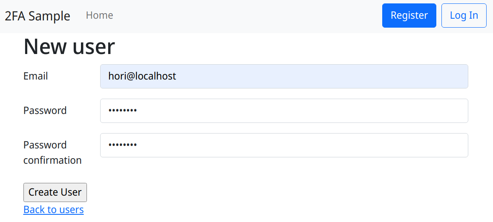
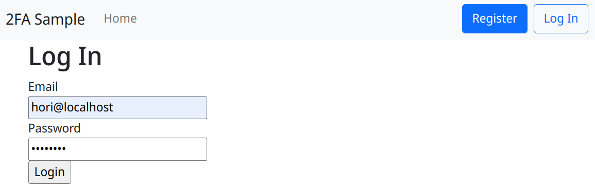
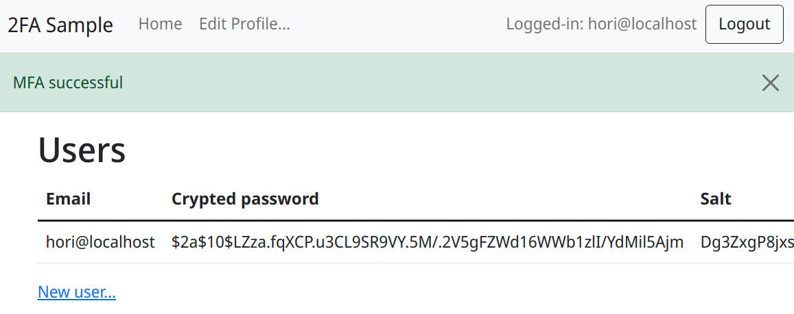

# Sorcery で二段階認証 2FA を実装したサンプルコード

 - Ruby 3.1
 - Ruby on Rails 7
 - Sorcery
 - google-authenticator-rails, ~> 3.0

Ruby on Rails で非常に簡単に2要素認証 (2FA) を組み込むサンプル。解説 https://www.nslabs.jp/digital-identity.rhtml

2FAは、パスワードのような知識要素と、デヴァイスのような所有要素の両方を確認する方法。Google Authenticator (Google 認証システム) を使えば, SMS認証のように電話を使わなくてもよいので、追加コストも掛からない。実装も簡単。

二つを組み合わせるやり方として「秘密の質問」がある。最悪なのは秘密の質問「だけ」でログイン可能にするもの。そもそも二つになっていない。また、秘密の質問の回答は、まったく秘密ではないことも多く、絶対に採用してはいけない. 生年月日やペットの名前は秘密情報ではない.

余談だが、パスワード定期変更も、弱いパスワードを使うインセンティブにしかならず、採用してはならない。ユーザは、たいてい末尾だけ変えるとかで、何回かのちに元のパスワードを使う.


## How to run

`config/database.yml.sample` ファイルを `database.yml` にコピーし, 適宜編集.

```shell
  $ bin/rails db:migrate
  $ passenger start
```

ユーザ登録

ログイン画面. ID (メイルアドレス) とパスワード.
 

1要素目の認証が成功したので、QRコードで登録を促す. 当然, 2回目以降はQRコードを表示しない (してはならない)。
 
ログイン成功.



## 今後の課題 (未実装)

スマフォ紛失に備えて、あらかじめリカバリ方法の用意が必須。パスワード覚えていれば、パスワード確認したうえでアカウントの回復コード (所有要素) がセオリー.

パスワード忘れのほうが、難易度高い。

そもそも, スマフォに Google Authenticator をインストールしているので、第三者からそれが使える状況だと、Webブラウザも当然使えて、パスワード自動入力されて意味ない。SMS も email もその端末で受け取れる。スマフォのロックスクリーン滅茶滅茶重要。

落としどころとしては、事前登録された「複数の」メイルアドレスに、アカウント回復しようとしている警告を送信、ぐらいか。要求レベル高ければ、郵送で確認コード送付? (物理/経路外)


## 実装メモ

### パッケージ依存関係

 1. `google-authenticator-rails` パッケージは `rotp = 3.3.0` に依存しており、このヴァージョンが内部で `URI.encode()` を呼び出しているため、Ruby 3.0 で動かない。新しい `rotp` パッケージは修正済だが、どうしたものか.

`specifications/google-authenticator-rails-2.0.0.gemspec` ファイルを編集し、修正済である rotp v4.0.2 に依存するようにする。-> 今度はrotp の非互換な変更で動かないので、この対策はダメ。

 2. 更新されていない `google-qr` パッケージ (最終が 2012年) も同様。こういうのは困るね。`URI.encode()` を定義してやるしかない。


### Rails 7 (importmap-rails) + Bootstrap 5 JavaScript not working

`importmap-rails` を使う場合, `<body>` 内に `<script src="/bootstrap5/js/bootstrap.bundle.min.js">` タグを書いても, 画面遷移後に JavaScript が正常に動かない. 一見動いてるように見えるのが混乱する。

```shell
  $ bin/importmap pin bootstrap
```
`config/importmap.rb` ファイルに次が追加される.

```ruby
pin "bootstrap", to: "https://ga.jspm.io/npm:bootstrap@5.1.3/dist/js/bootstrap.esm.js"
pin "@popperjs/core", to: "https://ga.jspm.io/npm:@popperjs/core@2.11.5/lib/index.js"
```

`app/javascript/application.js` ファイルに `import` 文を追加.

```javascript
import * as bootstrap from "bootstrap"
```


## 先行事例

このリポジトリを fork した.
[sorceryを使用した二段階認証を実装した - おふとんの中から](https://yu1056y.hatenablog.com/entry/2019/04/21/164540)

その元ネタ. Rails v4.2, google-authenticator-rails v1.2.
https://moneyforward.com/engineers_blog/2015/08/06/google-authenticator-rails/

マネーフォワードエンジニアブログのほうがよい。それを元にしたゆいな (id:yu1056y) 氏のソースコードは、控えめに言って問題が多く、作り直した。

2014年でやや古いが, 直接 rotp パッケージと rqrcode パッケージを使う解説.
[Rubyで2段階認証(2FA)用のQRコードを生成する流れ - Qiita](https://qiita.com/mitz/items/878e8c3401a0eab4ddb4)


This README would normally document whatever steps are necessary to get the
application up and running.

Things you may want to cover:

* Ruby version

* System dependencies

* Configuration

* Database creation

* Database initialization

* How to run the test suite

* Services (job queues, cache servers, search engines, etc.)

* Deployment instructions

* ...
